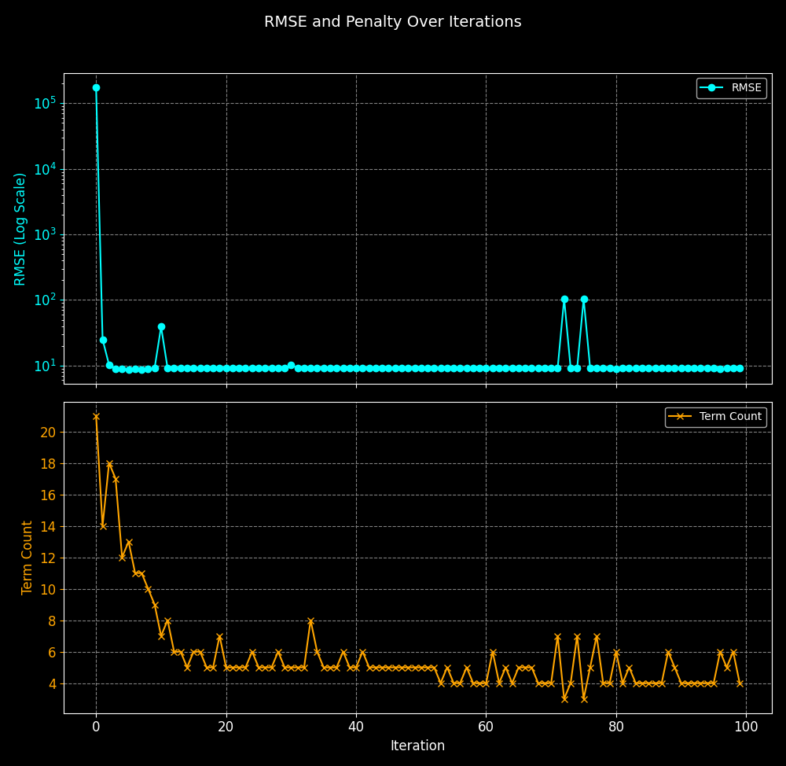

# Genetic Algorithm for Bivariate Polynomial Regression

This project implements a Genetic Algorithm (GA) to perform bivariate polynomial regression by selecting significant polynomial terms up to a specified degree. The GA optimizes the selection of polynomial terms and their coefficients to fit a given dataset, minimizing the Root Mean Squared Error (RMSE) while penalizing model complexity to avoid over-parameterization.

## Features

- **Bivariate Polynomial Degree Selection**: Automatically selects the most suitable polynomial terms involving two variables (e.g., \( x^i y^j \)).
- **Coefficient Estimation**: Estimates coefficients for the selected terms using linear regression.
- **Customizable GA Parameters**: Adjust population size, number of generations, mutation rate, and tournament size to tune the optimization process.
- **Penalty for Over-Parameterization**: The algorithm minimizes RMSE while penalizing overly complex models to avoid overfitting.
- **Test Suite**: Includes tests using Google Test to validate the algorithm's correctness.

---

## Dependencies

- **C++17 or higher**: Required for the core implementation.
- **[Eigen 3.3+](http://eigen.tuxfamily.org/)**: For efficient matrix and vector operations.
- **[Google Test](https://github.com/google/googletest)**: For running unit tests to ensure functionality.
- **[yaml-cpp](https://github.com/jbeder/yaml-cpp)** : for parsing the yaml file 

---

## Installation Guide

1. **Clone the Repository**:
    ```bash
    git clone https://github.com/HesamTaherzadeh/Meta-heuristic-Regression.git
    cd Meta-heuristic-Regression
    ```

2. **Install Dependencies**:
    - Ensure that `Eigen` is installed and available on your system.
    - Download and build `Google Test` or link it directly if already installed.
    
    For example, you can install `Eigen` on Ubuntu:
    ```bash
    sudo apt-get install libeigen3-dev
    ```

3. **Build the Project**:
    ```bash
    mkdir build
    cd build
    cmake ..
    make
    ```

4. **Run the Program**:
    After building, you can run the binary:
    ```bash
    ./genetic_algorithm /path/to/config # for instance  config/cfg.yaml
    ```

5. **Run Tests**:
    To run the included test suite:
    ```bash
    ./runTests
    ```

## Configuration Guide

The config file should contain parameters below, which is included in the table 

| Parameter         | Value     | Description                                                                                   |
|-------------------|-----------|-----------------------------------------------------------------------------------------------|
| `data_size`       | 1000      | The number of data samples generated for the regression task.                                |
| `n`               | 5         | The maximum degree for the polynomial terms in the `x` variable.                            |
| `m`               | 5         | The maximum degree for the polynomial terms in the `y` variable.                            |
| `population_size` | 100       | The number of individuals (potential solutions) in each generation of the genetic algorithm.|
| `generations`     | 100       | The total number of generations the genetic algorithm will run to evolve solutions.         |
| `mutation_rate`   | 0.05      | The probability that a mutation (random change) will occur in an individual's genome.       |
| `tournament_size` | 3         | The number of individuals selected for each tournament, where the best one gets to reproduce.|
| `rng_seed`        | 0         | The seed for the random number generator, ensuring reproducible results.                    |
| `patience`        | 80        | The number of generations without improvement before the algorithm stops early (early stopping).|
| `coeff_lambda`    | 1         | The penalty coefficient applied to the count of small coefficients to avoid over-parameterization.|
| `rmse_lambda`     | 0.1       | The penalty factor applied to model complexity, encouraging simpler models.                 |

## Example Output

The Genetic Algorithm iteratively improves the polynomial model by evolving a population of potential solutions. Here’s an example of the output during execution:

```math
z = -0.2 \cdot x^3 \cdot y^5 + 0.3 \cdot x^2 \cdot y - 0.4 \cdot x \cdot y^2 + 0.5 \cdot x \cdot y + 1.0 + \text{noise}
```

```
Generation 0, Best Fitness (RMSE + penalty): 18.5337
Best Genome: 110000001110010010110101000000011000
Generation 10, Best Fitness (RMSE + penalty): 14.2547
Best Genome: 001000001100111000010101000000001000
Generation 20, Best Fitness (RMSE + penalty): 11.7244
Best Genome: 001000111000010000100001000000010000
Generation 30, Best Fitness (RMSE + penalty): 10.5413
Best Genome: 101000011000010000000001000000000000
Generation 40, Best Fitness (RMSE + penalty): 10.4494
Best Genome: 000000011000010000100001000000000000
Generation 50, Best Fitness (RMSE + penalty): 10.3539
Best Genome: 000000011000010000000001000000000000
Generation 60, Best Fitness (RMSE + penalty): 10.3539
Best Genome: 000000011000010000000001000000000000
Generation 70, Best Fitness (RMSE + penalty): 10.3539
Best Genome: 000000011000010000000001000000000000
Generation 80, Best Fitness (RMSE + penalty): 10.3539
Best Genome: 000000011000010000000001000000000000
Generation 90, Best Fitness (RMSE + penalty): 10.3539
Best Genome: 000000011000010000000001000000000000
Generation 99, Best Fitness (RMSE + penalty): 10.3539
Best Genome: 000000011000010000000001000000000000
```

### Final Results

After completing the evolution process, the algorithm provides the final set of selected polynomial terms and their estimated coefficients:

```
Selected terms (x^i y^j):
x^1 y^1
x^1 y^2
x^2 y^1
x^3 y^5
Coefficients:  0.511756 -0.402186  0.300916      -0.2
Intercept: 0.856693
```

This output indicates the terms chosen by the GA for the regression model and the corresponding coefficients.

---

## Visualizing Performance

The following plot demonstrates how the RMSE and the number of terms evolve over iterations, providing insights into how the algorithm balances error minimization and model complexity:



